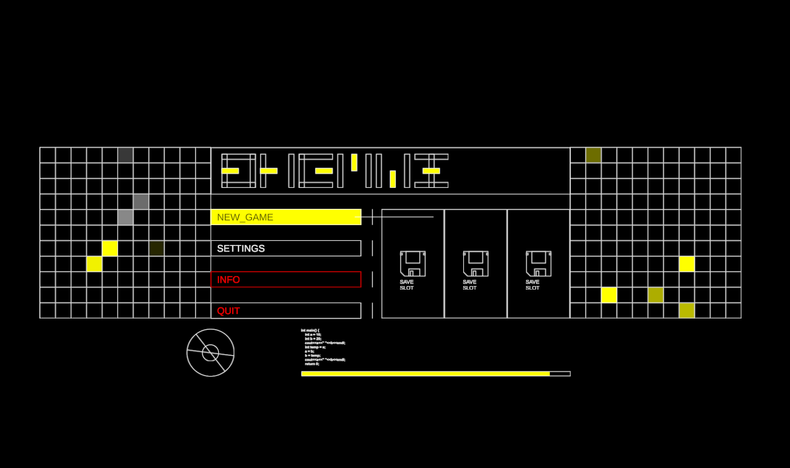

# Futuristic UI

 

Projekt został utworzony na wersji Unity 2021.3.11f1  
Scena z rozwiązaniem znajduje się w folderze: Assets/Scenes

Po kliknięciu w przycisk "Settings" wyświetlony zostanie popup, na którym znajdują się: scrollView, przyciski, suwak oraz toggle. Zaproponowane rozwiązanie sterowania UI zostało zamknięte jako moduł w osobnej assemblacji. System sterowania postarałem się aby był otwarty na ewentualną rozbudowę oraz pozostał jak najbardziej uniwersalny. Samo sterowanie możliwe jest za pomocą myszy, klawiatury oraz GamePad'a.

### Klawiatura
 - Strzałki - pozwalają na zmianę selekcji wybranego przycisku na UI.
 - Enter - Akcja submit przycisku (klik).
 - Esc - Zamyka otwarte okno popup.
 
 ### GamePad
W przypadku gamepada najlepszym rozwiązaniem, ze względu na różne mapowanie przycisków, przez różnych producentów np. Pad XBox lub Pad DS4, byłoby użycie pluginu "Rewired". Nie chiałem wykorzystywać płatnych dodatków ze względów licencyjnych, więc sterowanie zostało dostosowane do pada DualShock 4 (dla Xboxa też będzie działać natomiast przyciski prawego krzyżaka będą niestety odbite :( ).

- Lewa gajga - pozwala na zmianę selekcji wybranego przycisku na UI.
- Przycisk O - Akcja submit przycisku (klik).
- Przycisk X - Zamyka otwarte okno popup.

## Stany przycisków
 - Selekcja - przycisk podświetla swoje tło na żółto, a kolor napisu zamienia się na czarny.
 - Przycisk zablokowany (pomijalny podczas selekcji) - ramka przycisku oraz tekst ustawia się na kolor czerwony.
 - Przycisk wyłączony (możliwy do wyboru ale nie klikalny) - Tekst ustawia się na kolor czerwony. Ramka po selekcji zmienia kolor na żółty.
 - Submit - Indykowany jest za pomocą dźwięku w zależności od tego czy przycisk jest wyłączony lub nie, uruchomiony będzie inny dźwięk.
 
 ## Animacje
Postanowiłem dodać rówież trochę życia do UI animując niektóre elementy layoutu. Animowany jest dolny pasek postępu, wypełnienie lewego dolnego koła oraz dwie siatki z lewej oraz prawej strony. Animacje lewej oraz prawej siatki wyszły myślę najciekawiej, ponieważ kwadraty pojawiają się w sposób losowy dodając ciekawości :).
